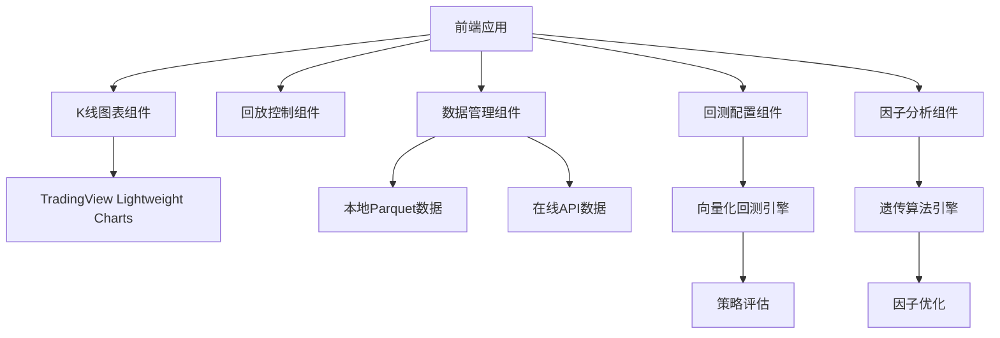

# K线回放与回测系统实现计划

## 1. 项目现状分析

### 当前项目结构
- 基于React + TypeScript + Tailwind CSS
- 使用Chart.js实现K线图表（折线图模拟）
- 基本的播放控制和时间轴功能
- 数据导入/导出功能

### 存在的问题
- 图表不是蜡烛图，不符合TradingView风格
- 不支持鼠标点击选择起始点开始回放
- 缺少回测功能
- 不支持本地Parquet缓存数据
- 不支持在线API数据
- 不支持向量化回测
- 缺少遗传算法和因子挖掘功能

## 2. 技术栈升级

### 前端技术栈
- **图表库**：替换Chart.js为TradingView Lightweight Charts（支持蜡烛图和专业K线功能）
- **状态管理**：保持Zustand
- **UI框架**：保持Tailwind CSS
- **数据处理**：添加Pandas.js或类似库用于向量化计算
- **文件处理**：添加Parquet.js用于读取本地Parquet文件

### 后端技术栈（新增）
- **Node.js + Express**：处理API请求和数据处理
- **数据存储**：本地文件系统（Parquet文件）
- **数据获取**：集成AKShare、腾讯、新浪API
- **计算引擎**：使用NumPy.js或类似库进行向量化计算
- **遗传算法**：实现遗传算法库用于因子挖掘

## 3. 核心功能实现计划

### 3.1 TradingView风格K线图表
- 集成TradingView Lightweight Charts库
- 实现蜡烛图显示
- 支持鼠标交互：点击选择起始点、缩放、拖拽
- 实现技术指标叠加（MA、MACD、RSI等）

### 3.2 回放控制功能
- 实现鼠标点击K线图选择起始日期
- 优化播放控制：支持暂停、继续、重置
- 实现播放速度调节（0.5x-10x）
- 添加时间轴拖拽功能

### 3.3 数据管理系统
- **本地Parquet缓存**：读取cache_data/*.parquet文件
- **在线API集成**：实现AKShare、腾讯、新浪API数据获取
- **数据转换**：将不同数据源统一转换为标准格式
- **数据缓存**：实现本地缓存机制减少API调用

### 3.4 回测系统
- **向量化回测引擎**：使用向量化计算实现高性能回测
- **策略定义**：支持自定义交易策略
- **性能评估**：计算收益率、夏普比率、最大回撤等指标
- **批量回测**：支持同时回测多只股票

### 3.5 遗传算法与因子挖掘
- **因子库**：实现常用技术因子
- **遗传算法**：使用遗传算法优化因子组合
- **因子评估**：评估因子有效性和相关性
- **可视化**：展示因子表现和优化结果

## 4. 架构设计

### 4.1 系统架构


### 4.2 数据流程
1. 前端请求数据 → 优先从本地Parquet缓存读取
2. 本地缓存不存在 → 从在线API获取数据
3. 获取的数据 → 转换为标准格式 → 存储到本地缓存
4. 回测请求 → 读取本地数据 → 执行向量化计算 → 返回结果
5. 因子挖掘 → 执行遗传算法 → 优化因子组合 → 评估结果

## 5. 实现步骤

### 阶段1：基础架构搭建
1. 安装必要的依赖库
2. 集成TradingView Lightweight Charts
3. 实现基本的蜡烛图显示
4. 搭建后端服务框架

### 阶段2：核心功能实现
1. 实现鼠标点击选择起始点功能
2. 优化回放控制逻辑
3. 实现本地Parquet数据读取
4. 集成在线API数据获取

### 阶段3：回测系统实现
1. 实现向量化回测引擎
2. 支持自定义交易策略
3. 实现性能评估指标
4. 优化回测性能

### 阶段4：高级功能实现
1. 实现遗传算法引擎
2. 开发因子库
3. 实现因子挖掘功能
4. 优化系统性能

### 阶段5：测试与优化
1. 功能测试
2. 性能测试
3. 数据准确性验证
4. 用户体验优化

## 6. 性能优化策略

### 6.1 前端优化
- 使用WebWorker处理复杂计算
- 实现数据分页加载
- 优化图表渲染性能
- 使用React.memo和useMemo减少重渲染

### 6.2 后端优化
- 实现数据缓存机制
- 使用流式处理大文件
- 优化数据库查询
- 实现并行计算

### 6.3 计算优化
- 使用向量化计算替代循环
- 实现计算结果缓存
- 优化遗传算法参数
- 使用WebAssembly加速计算

## 7. 风险评估与处理

### 7.1 风险因素
- 数据获取失败
- 计算性能瓶颈
- 内存使用过高
- 浏览器兼容性问题

### 7.2 处理策略
- 实现数据获取重试机制
- 优化计算算法
- 实现数据分批处理
- 进行浏览器兼容性测试

## 8. 预期成果

- 专业的TradingView风格K线回放系统
- 支持蜡烛图和技术指标
- 鼠标点击选择起始点开始回放
- 本地Parquet缓存 + 在线API备用
- 向量化回测功能，支持快速回测5000只股票
- 遗传算法和因子挖掘功能
- 高性能、用户友好的界面

## 9. 技术依赖

### 前端依赖
- react: ^18.3.1
- typescript: ^5.8.3
- tailwindcss: ^3.4.19
- zustand: ^5.0.12
- lightweight-charts: ^5.1.0
- parquetjs: ^0.10.0
- pandas-js: ^0.2.4

### 后端依赖
- express: ^4.18.2
- node-fetch: ^3.3.2
- akshare: ^1.9.99
- parquetjs: ^0.10.0
- numpy: ^1.26.0
- genetic-js: ^0.1.6

## 10. 项目结构

```
/workspace
├── src/
│   ├── components/
│   │   ├── KlineChart.tsx          # 专业K线图表组件
│   │   ├── PlaybackControls.tsx    # 回放控制组件
│   │   ├── DataManager.tsx         # 数据管理组件
│   │   ├── BacktestConfig.tsx      # 回测配置组件
│   │   └── FactorAnalysis.tsx      # 因子分析组件
│   ├── pages/
│   │   └── KlineReplay.tsx         # 主页面
│   ├── store/
│   │   └── index.ts                # 状态管理
│   ├── types/
│   │   └── index.ts                # 类型定义
│   ├── utils/
│   │   ├── dataProcessor.ts        # 数据处理工具
│   │   ├── backtestEngine.ts       # 回测引擎
│   │   └── geneticAlgorithm.ts     # 遗传算法
│   └── data/
│       └── sampleData.ts           # 示例数据
├── api/
│   ├── routes/
│   │   ├── data.ts                 # 数据路由
│   │   └── backtest.ts             # 回测路由
│   ├── services/
│   │   ├── dataService.ts          # 数据服务
│   │   └── backtestService.ts      # 回测服务
│   └── utils/
│       └── apiClient.ts            # API客户端
├── cache_data/                     # Parquet缓存文件
├── package.json
└── tsconfig.json
```