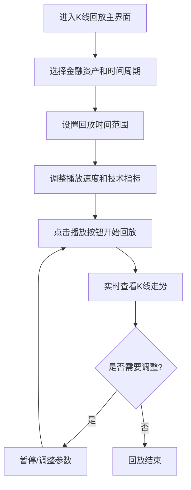

## 1. Product Overview
K线回放功能是一个专业的金融数据可视化工具，用于模拟和回放股票、加密货币等金融资产的历史K线数据。
- 帮助交易员和投资者分析历史市场走势，测试交易策略，提高交易决策能力
- 为金融教育和培训提供直观的市场走势演示工具

## 2. Core Features

### 2.1 User Roles
| Role | Registration Method | Core Permissions |
|------|---------------------|------------------|
| Normal User | No registration required | Access all K-line replay features |

### 2.2 Feature Module
1. **K线回放主界面**：K线图表展示、时间轴控制、播放控制、数据选择
2. **设置面板**：时间范围选择、播放速度调整、技术指标配置
3. **数据管理**：数据源选择、数据导入/导出

### 2.3 Page Details
| Page Name | Module Name | Feature description |
|-----------|-------------|---------------------|
| K线回放主界面 | K线图表展示 | 实时渲染K线图表，支持蜡烛图、折线图等多种图表类型，显示开盘价、收盘价、最高价、最低价等数据 |
| K线回放主界面 |时间轴控制 | 可拖动时间轴选择特定时间点，显示当前回放时间和总时长 |
| K线回放主界面 |播放控制 | 支持播放/暂停/重置操作，提供播放速度调节功能 |
| K线回放主界面 |数据选择 | 支持选择不同金融资产和时间周期（1分钟、5分钟、15分钟、1小时、1天等） |
| 设置面板 |时间范围选择 | 允许用户设置回放的起始和结束时间，支持预设时间范围 |
| 设置面板 |播放速度调整 | 提供0.5x到10x的播放速度调节，满足不同分析需求 |
| 设置面板 |技术指标配置 | 支持添加和配置常用技术指标，如MA、MACD、RSI、KDJ等 |
| 数据管理 |数据源选择 | 支持内置示例数据和用户自定义数据导入 |
| 数据管理 |数据导入/导出 | 支持CSV格式数据导入和导出，方便用户使用自己的历史数据 |

## 3. Core Process
用户进入K线回放主界面后，首先选择要分析的金融资产和时间周期，然后设置回放的时间范围和播放速度，最后点击播放按钮开始回放。在回放过程中，用户可以随时暂停、调整速度或拖动时间轴到特定时间点进行分析。

## 4. User Interface Design
### 4.1 Design Style
- **主色调**：深蓝色 (#1a202c) 作为背景，白色 (#ffffff) 作为主要文本颜色，绿色 (#48bb78) 表示上涨，红色 (#f56565) 表示下跌
- **按钮风格**：圆角矩形按钮，带有轻微的阴影效果，悬停时有颜色变化
- **字体**：使用无衬线字体如Inter，标题16-20px，正文14px，小文本12px
- **布局风格**：卡片式布局，清晰的视觉层次，适当的留白
- **图标风格**：使用简洁的线性图标，如播放、暂停、重置等控制按钮

### 4.2 Page Design Overview
| Page Name | Module Name | UI Elements |
|-----------|-------------|-------------|
| K线回放主界面 | K线图表展示 | 占据页面主要区域的图表区域，背景为深色，K线使用绿色和红色区分涨跌，网格线为浅灰色 |
| K线回放主界面 |时间轴控制 | 位于图表下方的可拖动时间轴，当前时间点有明显标记，支持缩放操作 |
| K线回放主界面 |播放控制 | 位于时间轴下方的播放控制栏，包含播放/暂停/重置按钮，以及速度调节滑块 |
| K线回放主界面 |数据选择 | 位于页面顶部的下拉选择框，用于选择金融资产和时间周期 |
| 设置面板 |时间范围选择 | 位于右侧的设置面板中，包含日期选择器和时间输入框 |
| 设置面板 |播放速度调整 | 位于设置面板中的滑块控件，带有速度数值显示 |
| 设置面板 |技术指标配置 | 位于设置面板中的复选框和参数输入框，支持添加/删除技术指标 |
| 数据管理 |数据源选择 | 位于顶部导航栏的下拉菜单，包含内置数据和自定义数据选项 |
| 数据管理 |数据导入/导出 | 位于顶部导航栏的按钮，点击后弹出文件选择对话框 |

### 4.3 Responsiveness
- **桌面优先**设计，适配1200px以上的屏幕
- **平板适配**：在768px-1199px屏幕上，设置面板会自动折叠为可展开的侧边栏
- **移动适配**：在767px以下屏幕上，布局会调整为垂直排列，优先展示K线图表
- **触摸优化**：支持触摸操作，如滑动时间轴、点击控制按钮等

### 4.4 3D Scene Guidance
无3D场景需求