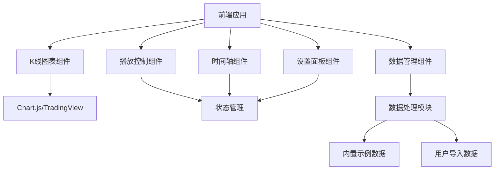
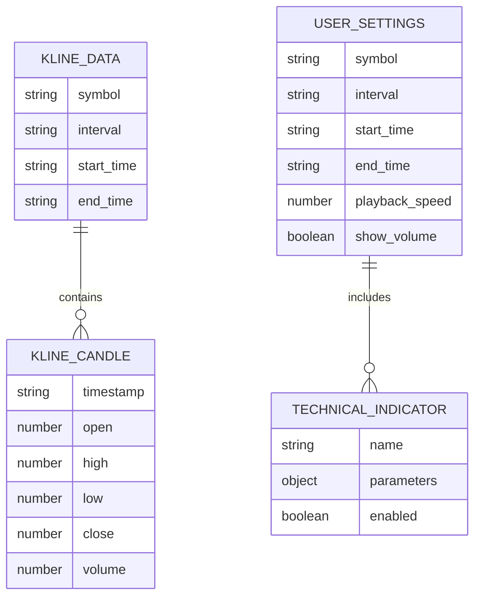

## 1. Architecture Design


## 2. Technology Description
- **前端**：React@18 + TypeScript + Tailwind CSS@3 + Vite
- **初始化工具**：vite-init
- **图表库**：Chart.js 或 TradingView Lightweight Charts
- **状态管理**：Zustand
- **数据处理**：Papa Parse（用于CSV文件处理）
- **后端**：无（纯前端实现）
- **数据存储**：浏览器LocalStorage（用于保存用户设置和导入的数据）

## 3. Route Definitions
| Route | Purpose |
|-------|---------|
| / | K线回放主界面 |

## 4. API Definitions
无后端API需求，所有功能均在前端实现

## 5. Server Architecture Diagram
无后端架构需求

## 6. Data Model
### 6.1 Data Model Definition


### 6.2 Data Definition Language
无数据库需求，使用前端数据结构和LocalStorage存储

#### 前端数据结构
```typescript
// K线数据结构
export interface KlineCandle {
  timestamp: string;
  open: number;
  high: number;
  low: number;
  close: number;
  volume: number;
}

export interface KlineData {
  symbol: string;
  interval: string;
  startTime: string;
  endTime: string;
  candles: KlineCandle[];
}

// 技术指标配置
export interface TechnicalIndicator {
  name: string;
  parameters: Record<string, any>;
  enabled: boolean;
}

// 用户设置
export interface UserSettings {
  symbol: string;
  interval: string;
  startTime: string;
  endTime: string;
  playbackSpeed: number;
  showVolume: boolean;
  indicators: TechnicalIndicator[];
}
```

#### 内置示例数据
提供BTC/USDT、ETH/USDT等主流加密货币的历史K线数据，以及A股、美股的示例数据，时间范围涵盖最近1年，包含不同时间周期（1分钟、5分钟、15分钟、1小时、1天）的数据。

#### 数据导入格式
支持CSV格式数据导入，字段包括：
- timestamp：时间戳（ISO格式或Unix时间戳）
- open：开盘价
- high：最高价
- low：最低价
- close：收盘价
- volume：成交量